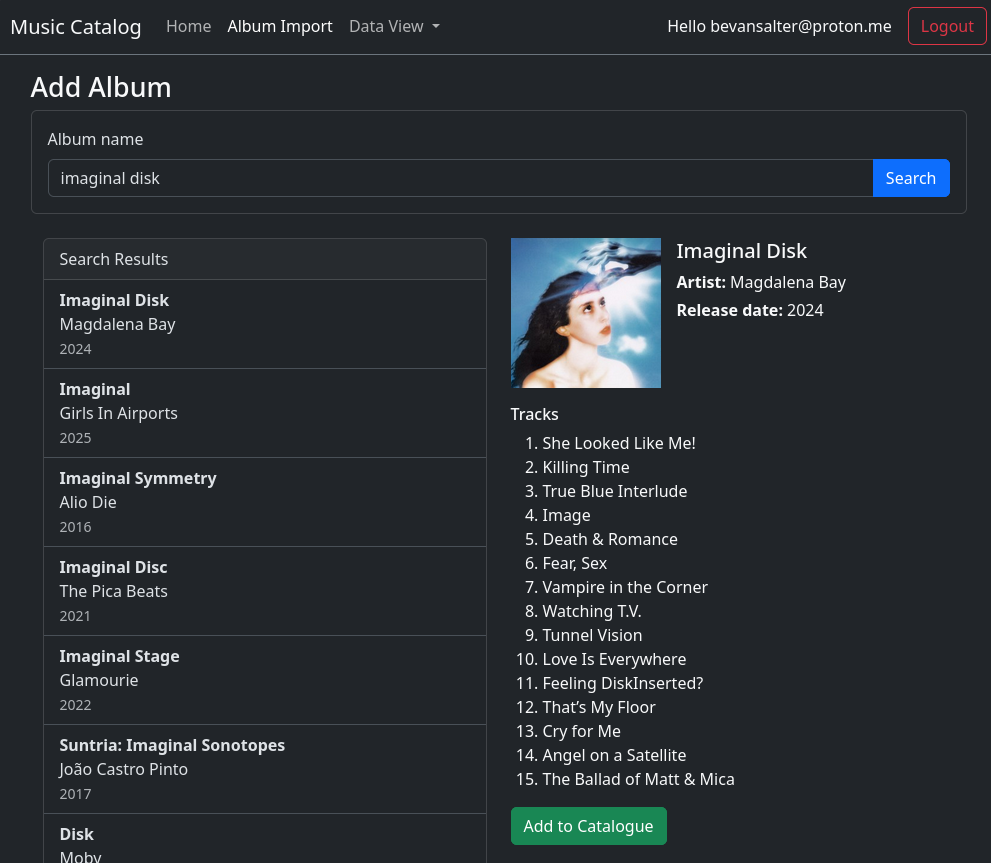

# Music Catalog

<p align="center">
  
</p>

Music Catalog is a personal project built to help users create their own music listening catalogue and discovery
database. As someone who listens to a lot of music, I wanted a better way to
keep track of albums I planned to listen to, revisit favourites, and gradually build a more intentional listening
history over time.

The application allows users to search for albums and artists using external music metadata sources, import them into a
local catalogue, and browse detailed information about albums, artists, genres, and tracks. The long-term goal is for
the platform to become part listening diary, part discovery tool, and part personal music archive.

The project is still very much a work in progress, with new features and integrations actively being developed.


# Current Features

- Search for albums using the MusicBrainz API
- Import album metadata into a local PostgreSQL database
- View albums, artists, genres, and tracks
- JWT-based authentication and authorisation
- Blazor Hybrid frontend application
- ASP.NET Core Web API backend
- Relational database design using Entity Framework Core
- Swagger/OpenAPI support for API exploration and testing
- Docker-based local development and deployment
- Automated unit and component testing


# Planned Features

Some of the features currently planned or in development include:

- Spotify integration
- Music discovery and recommendation features
- Listening diary/history tracking
- Improved album and track metadata
- Better UI/UX and visual design improvements
- AI-assisted discovery and recommendations
- Playlist and listening queue management
- User ratings, favourites, and reviews


# Development Setup

This project uses ASP.NET Core User Secrets for local development configuration. These settings can be setup using
appsettings.Development.json too.

## Initialize User Secrets

Run from the solution root:

```
dotnet user-secrets init --project src/MusicCatalog.Api
```

## Configure Database Connection

```
dotnet user-secrets set "ConnectionStrings:MusicCatalog" "Host=localhost;Port=5433;Database=musiccatalog;Username=music;Password=music" --project src/MusicCatalog.Api
```

## Configure JWT Authentication

Make sure that the JWT key is greater than 256 bits.

```
dotnet user-secrets set "Jwt:Issuer" "MusicCatalog.Api" --project src/MusicCatalog.Api

dotnet user-secrets set "Jwt:Audience" "MusicCatalog.Client" --project src/MusicCatalog.Api

dotnet user-secrets set "Jwt:Key" "this-is-a-local-development-jwt-signing-key-123456789" --project src/MusicCatalog.Api

dotnet user-secrets set "Jwt:ExpiryMinutes" "60" --project src/MusicCatalog.Api
```

## View Current User Secrets

```
dotnet user-secrets list --project src/MusicCatalog.Api
```

## Create a New Migration

```
dotnet ef migrations add <MigrationName> --project src/MusicCatalog.Infrastructure --startup-project src/MusicCatalog.Api
  ```

## Run Database Migrations

```
dotnet ef database update --project src/MusicCatalog.Infrastructure --startup-project src/MusicCatalog.Api
  ```

## Start PostgreSQL

To start a development database, spin up the docker container using docker compose using the command below from the
docker folder in the repo root.

```
docker compose up -d
```


# Architecture

The project follows a Clean Architecture approach with a strong separation of concerns between the application layers.

## High Level Flow

1. The Blazor Hybrid application allows users to search for music.
2. External metadata is retrieved from the MusicBrainz API.
3. The metadata is mapped into internal domain/application models.
4. The ASP.NET Core API persists the data into PostgreSQL.
5. The frontend retrieves stored data from the API for display and management.

This structure keeps the UI, business logic, infrastructure concerns, and external integrations separated and easier to
maintain as the project grows.


# Solution Structure

## `MusicCatalog.Api`

ASP.NET Core Web API responsible for:

- Exposing REST endpoints
- Authentication and JWT handling
- Mediating application requests using MediatR
- Communicating with the application layer
- Swagger/OpenAPI integration

The API acts as the entry point into the backend system and keeps controllers lightweight by delegating logic into
application handlers.


## `MusicCatalog.Application`

Contains the core application logic and use cases.

Responsibilities include:

- CQRS handlers using MediatR
- Validation and orchestration logic
- DTOs and application models
- Interfaces for infrastructure dependencies
- Business workflows

This layer is intentionally isolated from infrastructure concerns to keep the application logic testable and
maintainable.


## `MusicCatalog.Domain`

Contains the core domain entities and domain rules.

Examples include:

- Albums
- Artists
- Tracks
- Genres

This layer represents the heart of the application and has no dependency on infrastructure or UI concerns.


## `MusicCatalog.Infrastructure`

Responsible for external concerns such as:

- Entity Framework Core database access
- PostgreSQL persistence
- Authentication infrastructure
- External service implementations
- Dependency injection wiring

This layer contains the concrete implementations of interfaces defined in the application layer.


## `MusicCatalog.ExternalMetadata`

Handles integration with external music metadata providers.

Currently includes:

- MusicBrainz integration

Future integrations planned:

- Spotify
- Additional metadata providers

Separating this into its own project keeps third-party integrations isolated from the rest of the application.


## `MusicCatalog.Web`

Blazor Hybrid frontend application.

Responsible for:

- User interaction and UI rendering
- Album search and browsing
- Authentication flows
- API communication
- Responsive UI components using Bootstrap

The frontend is intentionally lightweight and communicates with the API rather than directly accessing persistence
concerns.


## `MusicCatalog.Contracts`

Shared contracts between layers including:

- API request/response models
- Shared DTOs
- Authentication contracts

This helps reduce duplication and keeps communication between projects consistent.


## `MusicCatalog.ApiClient`

Typed API client abstractions used by the frontend application to communicate with the API.

Includes:

- Album API clients
- Artist API clients
- Authentication clients
- Token management

This provides a cleaner and more maintainable approach than scattering raw HTTP requests throughout the UI layer.


# Technologies Used

## ASP.NET Core

Used for building the REST API because it provides excellent performance, strong ecosystem support, and integrates
naturally with modern .NET tooling and dependency injection patterns.


## Blazor Hybrid

Chosen to allow a full .NET-based frontend experience while still supporting a modern interactive UI approach. It allows
code sharing across the stack and keeps the project entirely within the .NET ecosystem.


## PostgreSQL

Used as the primary relational database due to its reliability, strong relational capabilities, and excellent support
for complex querying and structured data.


## Entity Framework Core

Used for database access and persistence because it provides a productive ORM experience while still allowing strong
relational modelling and migrations support.


## MediatR

Used to implement CQRS-style request handling and reduce coupling between controllers and business logic. This helps
keep the application modular and easier to extend over time.


## JWT Authentication

Used to provide stateless and scalable authentication between the frontend and backend services.


## Docker & Docker Compose

Used for local development and deployment consistency. This simplifies onboarding, environment setup, and deployment
workflows.

The project is also self-hosted on a Linux home server using Docker-based deployments.


## Swagger / OpenAPI

Used for API documentation and endpoint testing during development.


## Testing Stack

### NUnit

Used as the primary unit testing framework.

### FluentAssertions

Provides more expressive and readable assertions in tests.

### NSubstitute

Used for mocking dependencies during unit testing.

### bUnit

Used for testing Blazor UI components and frontend behaviour.


# Status

Music Catalog is still under active development and many areas are unfinished or evolving. The current focus is on
strengthening the core catalogue functionality, improving metadata handling, and expanding discovery features.


